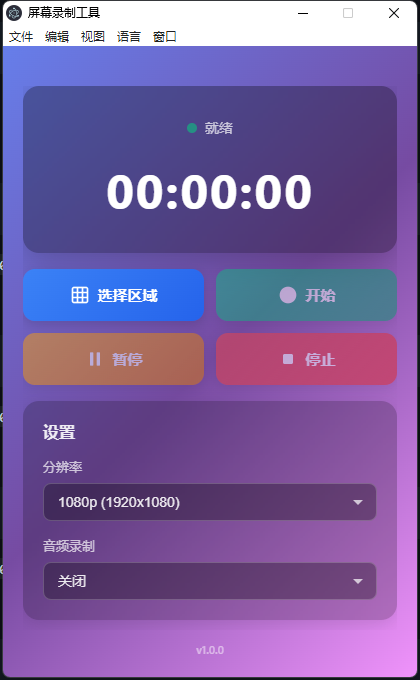
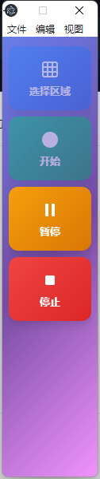

# 屏幕录制工具

一个使用 Electron 和 FFmpeg 的跨平台高质量屏幕区域录制桌面应用程序。

## 功能特性

- 🎯 鼠标拖拽选择任意屏幕区域
- 🎥 支持 720p 或 1080p 质量录制
- 🎵 可选音频录制
- 🌓 深色/浅色主题（跟随系统）
- ⚙️ 可自定义输出目录
- 🎨 Fluent 2 设计风格

## 技术规格

- **框架**: Electron
- **视频编码**: H.264
- **帧率**: 30 fps
- **输出格式**: MP4
- **最小选区**: 100x100 像素

## 界面截图

<br/>



<br/>




<br/>

## 安装

1. 安装依赖：
```bash
npm install
```

2. 运行应用程序：
```bash
npm start
```

## 构建

### 快速设置
根据你的平台运行设置脚本：
- **Windows**: `setup.bat`
- **macOS/Linux**: `./setup.sh`

或手动安装：
```bash
npm install
```

### 开发模式
```bash
npm start
```

### 生产构建

#### Windows
```bash
npm run build:win
```
输出: `dist/Screen Recorder-1.0.0-x64.exe` (NSIS 安装程序)

#### macOS
```bash
npm run build:mac
```
输出: `dist/Screen Recorder-1.0.0-x64.dmg` (DMG 安装程序)

#### Linux
```bash
npm run build:linux
```
输出: `dist/Screen Recorder-1.0.0-x86_64.AppImage`

#### 所有平台
```bash
npm run build
```

### 图标
构建前，需要将应用程序图标添加到 `assets/` 目录：
- `icon.ico` (Windows)
- `icon.icns` (macOS)
- `icon.png` (Linux)

使用图标生成脚本：
- **Windows**: `generate-icons.bat`
- **macOS/Linux**: `./generate-icons.sh`

详细说明请参阅 `assets/README.md`。

完整的构建文档请参阅 [BUILD.md](docs/BUILD.md)。

## 使用方法

1. 点击"选择区域"按钮选择要录制的屏幕区域
2. 拖动鼠标选择所需区域（最小 100x100 像素）
3. 按 Enter 确认或 ESC 取消
4. 点击"开始"按钮开始录制
5. 使用"暂停"按钮临时暂停录制
6. 点击"停止"按钮完成并保存视频

## 设置

- **分辨率**: 在 720p 和 1080p 输出之间选择
- **音频录制**: 开启/关闭音频捕获
- **输出目录**: 设置视频保存位置

## 项目结构

```
screen_capture/
├── main.js                 # 主进程（窗口管理、IPC）
├── preload.js              # IPC 桥接预加载脚本
├── recorder.js             # 屏幕录制和 FFmpeg 集成
├── menu-i18n.js            # 菜单栏国际化
├── package.json            # 项目配置和依赖
│
├── src/                    # 渲染进程源文件
│   ├── index.html          # 主窗口 UI
│   ├── styles.css          # 主窗口样式（渐变背景、玻璃态）
│   ├── renderer.js         # 主窗口逻辑和事件处理
│   ├── recording.html      # MediaRecorder 隐藏录制窗口
│   │
│   ├── i18n/               # 国际化
│   │   ├── i18n.js         # i18n 管理器
│   │   ├── zh-CN.js        # 中文翻译
│   │   └── en-US.js        # 英文翻译
│   │
│   └── selector/           # 区域选择窗口
│       ├── selector.html   # 区域选择器 UI
│       ├── selector.css    # 区域选择器样式（录制边框效果）
│       └── selector.js     # 区域选择器逻辑和状态管理
│
├── assets/                 # 应用程序资源
│   ├── icon.ico            # Windows 图标
│   ├── icon.icns           # macOS 图标
│   ├── icon.png            # Linux 图标
│   ├── icon.svg            # 源图标
│   ├── README.md           # 图标创建指南
│   └── entitlements.mac.plist  # macOS 权限配置
│
├── docs/                   # 文档
│   ├── 中文文档索引.md     # 中文文档索引
│   ├── 文档规范.md         # 文档标准
│   ├── 项目初稿设计.md     # 初始项目设计
│   ├── README_zh.md        # 中文 README
│   ├── QUICKSTART.md       # 快速入门指南
│   ├── QUICKSTART_zh.md    # 中文快速入门指南
│   ├── BUILD.md            # 构建指南
│   ├── IMPLEMENTATION.md   # 技术实现
│   ├── CHANGELOG.md        # 版本历史
│   ├── CHANGELOG_zh.md     # 中文版本历史
│   ├── PROJECT_SUMMARY.md  # 项目摘要
│   ├── PROJECT_SUMMARY_zh.md  # 中文项目摘要
│   ├── RELEASE_CHECKLIST.md   # 发布检查清单
│   │
│   ├── 新UI设计说明.md     # 新 UI 设计文档
│   ├── 简化模式功能说明.md  # 简化模式功能
│   ├── 透明标题栏实现说明.md  # 透明标题栏
│   ├── 录制区域边框视觉效果说明.md  # 录制边框效果
│   ├── 改进-录制时隐藏边框.md  # 录制时隐藏边框
│   │
│   ├── Bug修复-录制区域裁剪.md  # Bug 修复：区域裁剪
│   ├── Bug修复-打包后FFmpeg路径.md  # Bug 修复：生产环境 FFmpeg 路径
│   ├── Bug修复-切换语言退出.md  # Bug 修复：语言切换崩溃
│   ├── FFmpeg路径调试指南.md  # FFmpeg 路径调试
│   ├── 语言切换调试指南.md  # 语言切换调试
│   ├── 构建问题-图标格式错误.md  # 构建问题：图标格式
│   ├── 进程清理优化.md     # 进程清理优化
│   │
│   ├── demo_home.png       # 主界面截图
│   └── demo_right.png      # 简化模式截图
│
└── dist/                   # 构建输出（生成）
    ├── win-unpacked/       # Windows 解包构建
    ├── Screen Recorder-1.0.0-x64.exe  # Windows 安装程序
    └── ...                 # 其他平台构建
```

### 核心组件

**主进程 (Electron)**
- `main.js`: 窗口生命周期、菜单管理、IPC 处理器
- `recorder.js`: 屏幕捕获、FFmpeg 视频处理
- `menu-i18n.js`: 多语言菜单支持

**渲染进程**
- `src/index.html`: 带渐变背景的主 UI
- `src/renderer.js`: UI 逻辑、录制控制、i18n
- `src/selector/`: 带视觉反馈的区域选择

**国际化**
- `src/i18n/`: 语言管理系统
- 支持中文（zh-CN）和英文（en-US）
- 菜单栏和 UI 文本翻译

**录制系统**
- `src/recording.html`: MediaRecorder 屏幕捕获
- `recorder.js`: FFmpeg 集成用于 MP4 转换
- 区域裁剪和分辨率缩放

**功能特性**
- 🎨 现代渐变 UI 与玻璃态效果
- 🌐 多语言支持（中文/英文）
- 📐 简化模式，占用最小屏幕空间
- 🎬 带动画的可视化录制边框
- 🔄 透明标题栏集成

## 开发状态

- [x] 项目结构搭建
- [x] Fluent 2 设计的主界面
- [x] 区域选择界面
- [x] 设置管理
- [x] FFmpeg 集成
- [x] 录制功能（WebM 捕获 + MP4 转换）
- [x] 暂停/恢复支持
- [x] 打包配置
- [x] 多语言支持
- [x] 简化模式
- [x] 进程清理优化
- [ ] 音频录制支持
- [ ] 应用程序图标

## 文档

所有项目文档位于 `docs/` 文件夹：

- [中文文档索引](docs/中文文档索引.md) - 中文文档索引
- [文档规范](docs/文档规范.md) - 文档标准（中文）
- [QUICKSTART.md](docs/QUICKSTART.md) - 用户快速入门指南
- [BUILD.md](docs/BUILD.md) - 详细的构建和分发指南
- [IMPLEMENTATION.md](docs/IMPLEMENTATION.md) - 技术实现细节
- [CHANGELOG.md](docs/CHANGELOG.md) - 版本历史和更改
- [RELEASE_CHECKLIST.md](docs/RELEASE_CHECKLIST.md) - 发布准备清单
- [assets/README.md](assets/README.md) - 图标创建指南

## 已知限制

- 音频录制尚未实现（UI 切换按钮存在但不起作用）
- 录制时捕获整个屏幕，然后在编码过程中裁剪到选定区域
- 首次录制可能需要更长时间，因为需要初始化 FFmpeg

## 故障排除

**录制无法启动：**
- 确保已授予屏幕录制权限（macOS）
- 检查输出目录是否存在且可写

**FFmpeg 错误：**
- 应用程序通过 ffmpeg-static 自动捆绑 FFmpeg
- 查看控制台日志以获取详细错误信息

**视频质量问题：**
- 尝试调整分辨率设置（720p vs 1080p）
- CRF 值设置为 23（良好质量）。较低的值 = 更高的质量但文件更大。

## 许可证

MIT

